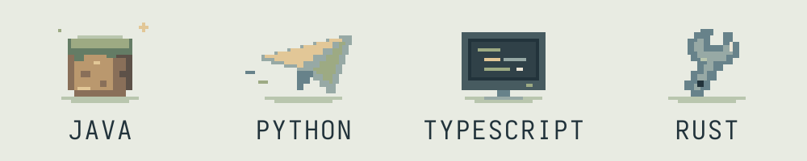

<picture>
  <source media="(prefers-reduced-motion: reduce) and (prefers-color-scheme: dark)" srcset="assets/workshop-dark.svg" />
  <source media="(prefers-reduced-motion: reduce)" srcset="assets/workshop-light.svg" />
  <source media="(prefers-color-scheme: dark)" srcset="assets/workshop-dark.gif" />
  
</picture>

### Привет, я Александр. Здесь — camera.

Пишу плагины для **Minecraft**, ботов для **Telegram** и инструменты для разработчиков. 
Работаю с **API**, **MCP** и **AI-интеграциями** — от игровой логики до автоматизации.

 

<picture>
  <source media="(prefers-reduced-motion: reduce) and (prefers-color-scheme: dark)" srcset="assets/toolbox-dark.svg" />
  <source media="(prefers-reduced-motion: reduce)" srcset="assets/toolbox-light.svg" />
  <source media="(prefers-color-scheme: dark)" srcset="assets/toolbox-dark.gif" />
  
</picture>

Java · Python · TypeScript · Rust

 

**На связи** — [Kwork ↗](https://kwork.ru/user/sacha_ch) 
Плагины, боты, API и AI-интеграции на заказ.
