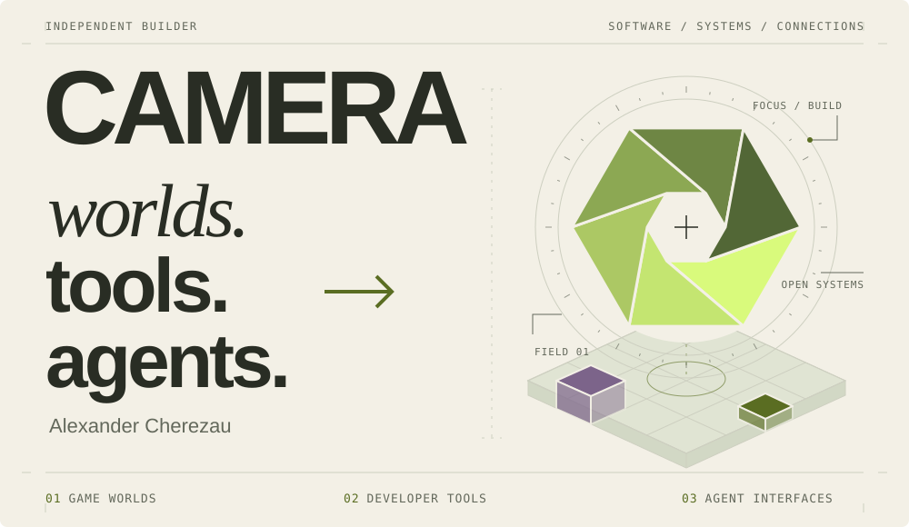

<picture>
  <source media="(prefers-color-scheme: dark)" srcset="assets/camera-dark.svg" />
  <source media="(prefers-color-scheme: light)" srcset="assets/camera-light.svg" />
  
</picture>

### Alexander Cherezau · camera

I build systems for game worlds, tools for AI agents, and automation that connects them.
Java for the worlds. Python and TypeScript for the connections. Rust when the tool belongs on your desktop.

**Ideas → architecture → working software.**

---

### Selected builds

**01 / AGENT INTERFACE** 
[**tg-account-mcp ↗**](https://github.com/AlexandrCherezau/tg-account-mcp) — Put Telegram workflows within reach of MCP clients. 
`Python` · `Telethon` · `MCP`

**02 / REPOSITORY INTELLIGENCE** 
[**RepoOracle ↗**](https://github.com/AlexandrCherezau/repooracle) — A GitHub link becomes an AI repository briefing in Telegram. 
`TypeScript` · `grammY` · `Groq`

**03 / GAME SYSTEMS** 
[**MeteoritePlugin ↗**](https://github.com/AlexandrCherezau/MeteoritePlugin) — Meteor strikes, impact effects, and loot events for Minecraft servers. 
`Java` · `Paper` · `Gradle`

**04 / DESKTOP WORKFLOW** 
[**pigtools ↗**](https://github.com/AlexandrCherezau/pigtools) — A Cockpit Tools fork with workspace-preserving Windsurf restarts when switching accounts. 
`Rust` · `Tauri` · `React`

---

**Have something to build?** Plugins, bots, APIs, AI integrations — [let’s talk on Kwork ↗](https://kwork.ru/user/sacha_ch). 
Открыт к проектам под ключ: от идеи до работающего решения.
