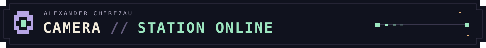
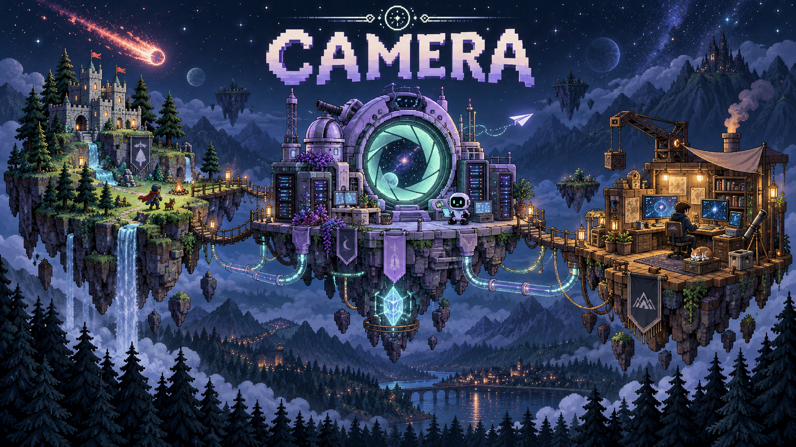
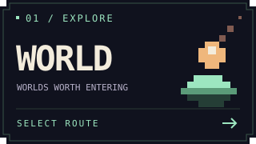
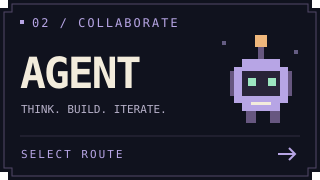
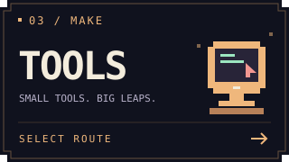
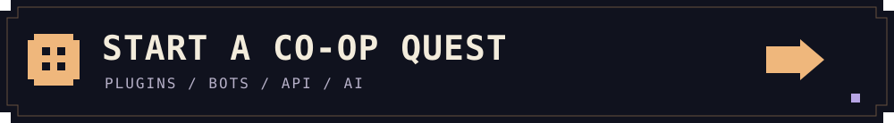

<p align="center">
  <strong>Alexander Cherezau · camera</strong><br />
  Game worlds. Agent interfaces. Tools that connect them.
</p>

### Choose your route

<p align="center">
  <a href="#worlds"></a>
  <a href="#agents"></a>
  <a href="#tools"></a>
</p>

<p align="center"><sub>Select a route. Open its mission file. Explore the code.</sub></p>

### Worlds

<details open>
<summary><strong>Enter the game island · Java / Paper / Spigot</strong></summary>

<br />

```text
MISSION 01
Make the world do something unexpected.
```

[**MeteoritePlugin ↗**](https://github.com/AlexandrCherezau/MeteoritePlugin)<br />
Meteor strikes, impact effects, and loot events for Minecraft servers.<br />
`Java` · `Paper` · `Gradle`

[**TownyDuels ↗**](https://github.com/AlexandrCherezau/TownyDuels)<br />
Arena duels and configurable kits for Minecraft servers.<br />
`Java` · `Spigot` · `Maven`

</details>

### Agents

<details>
<summary><strong>Enter the observatory · Python / TypeScript / MCP</strong></summary>

<br />

```text
MISSION 02
Give the agent useful things to do.

Telegram ── MCP ── agent tools
GitHub link ── AI ── repository briefing
```

[**tg-account-mcp ↗**](https://github.com/AlexandrCherezau/tg-account-mcp)<br />
Put Telegram workflows within reach of MCP clients.<br />
`Python` · `Telethon` · `MCP`

[**RepoOracle ↗**](https://github.com/AlexandrCherezau/repooracle)<br />
A GitHub link becomes an AI repository briefing in Telegram.<br />
`TypeScript` · `grammY` · `Groq`

</details>

### Tools

<details>
<summary><strong>Enter the workshop · Rust / Tauri / React</strong></summary>

<br />

```text
MISSION 03
Keep the workflow moving.
```

[**pigtools ↗**](https://github.com/AlexandrCherezau/pigtools)<br />
A [Cockpit Tools](https://github.com/jlcodes99/cockpit-tools) fork with workspace-preserving Windsurf restarts when switching accounts.<br />
`Rust` · `Tauri` · `React`

</details>

<br />

<details>
<summary>There is a small door behind the workshop...</summary>

<br />

```text
        .------------------------.
        |  CAMERA / MAINTENANCE  |
        |                        |
        |    ideas               |
        |      ↓                 |
        |    good questions      |
        |      ↓                 |
        |    working software    |
        '------------------------'
```

You found the maintenance hatch. The next build can start with your idea.

</details>

<br />

<a href="https://kwork.ru/user/sacha_ch"></a>

<p align="center">Есть идея? Плагины, боты, API и AI-интеграции — <a href="https://kwork.ru/user/sacha_ch">соберём под ключ ↗</a>.</p>
