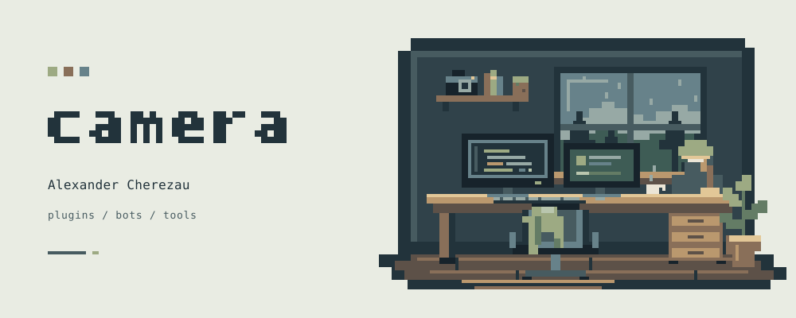

<picture>
  <source media="(prefers-color-scheme: dark)" srcset="assets/workshop-dark.svg" />
  <source media="(prefers-color-scheme: light)" srcset="assets/workshop-light.svg" />
  
</picture>

### Hi, I'm Alexander — camera here.

I make Minecraft plugins, Telegram bots and tools for developers. 
`Java` · `Python` · `TypeScript` · `Rust`

### A few things I've built

<table>
  <tr>
    <td width="50%" valign="top">
      <strong><a href="https://github.com/AlexandrCherezau/MeteoritePlugin">MeteoritePlugin ↗</a></strong>
      
Meteor strikes, impact effects and loot events for Minecraft servers.

      Java · Paper · Gradle
    </td>
    <td width="50%" valign="top">
      <strong><a href="https://github.com/AlexandrCherezau/tg-account-mcp">tg-account-mcp ↗</a></strong>
      
Telegram account tools for MCP clients.

      Python · Telethon · MCP
    </td>
  </tr>
  <tr>
    <td width="50%" valign="top">
      <strong><a href="https://github.com/AlexandrCherezau/repooracle">RepoOracle ↗</a></strong>
      
AI briefings about GitHub repositories, delivered in Telegram.

      TypeScript · grammY · Groq
    </td>
    <td width="50%" valign="top">
      <strong><a href="https://github.com/AlexandrCherezau/pigtools">pigtools ↗</a></strong>
      
My <a href="https://github.com/jlcodes99/cockpit-tools">Cockpit Tools</a> fork, with workspace-preserving Windsurf restarts.

      Rust · Tauri · React
    </td>
  </tr>
</table>

 

Есть проект? Плагины, боты, API и AI-интеграции — [напиши мне на Kwork ↗](https://kwork.ru/user/sacha_ch).
